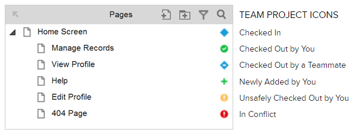

# Axure Team Project 가이드

## 1. 상태
### 1.1. Axure 페이지 상태

- Checked In : 해당 페이지가 체크인 된 상태
- Checked Out By You : 내가 해당 페이지를 체크아웃
- Checked Out bt a Teammate : 다른 동료가 해당 페이지를 체크아웃한 상태
- Newly Added By You : 내가 새롭게 추가한 페이지
- Unsafely Checked Out by You : 다른 동료가 체크아웃한 페이지를 나도 강제로 체크아웃한 상태
- In Conflict : 충돌이 일어난 상태(?)

### 1.2. 상태 별 설명
- 체크인 : 해당 페이지 편집이 끝나서 점유를 풀어 놓은 상태
- 체크아웃 : 내가 해당 페이지를 편집하기 위해 점유한 상태
- 체크아웃 하지 않아도 편집할 수 있는 항목 : Style, global variables, widget note, page notes fields, adaptive views

## 2. 팀 작업 설명

- Get All Changes from Team Directory : 모든 페이지의 변동사항을 서버에서 받아옴(체크인, 체크아웃 상태에는 변동 없음)
- Send All Changes to Team Directory : 체크아웃하지 않고 변경한 모든 항목(체크하지않고 변경할수 있는 항목 참고)들을 서버에 업로드(체크인, 체크아웃 상태에는 변동 없음)
- Chekch Out Everything : 모든 페이지를 내가 체크아웃(웬만하면 사용하면 안됨)
- Undo All Check Outs : 모든 페이지의 체크아웃을 취소(그동안 작업한 변동사항은 날아감)
- Get 로그인 Changes form Team Directory : '로그인' 페이지의 변경사항을 서버에서 받아옴(체크인, 체크아웃 상태에는 변동 없음)
- Check Out 로그인 : '로그인' 페이지를 내가 체크아웃함

## 3. 작업 플로우
### 3.1. 팀 프로젝트 불러오기
- 원격에서 최초로 다운 : 메뉴 > Team > Get and Open Team Project
- 기존 작업했던 팀 프로젝트 불러오기 : 메뉴 > File > Open

### 3.2. 페이지 편집 작업 흐름
1. 페이지 체크아웃
2. 해당 페이지 편집
3. Get All Changes From Team Directory
4. 해당 페이지 체크인 혹은 Send Changes to Team Directory

## 4. Tip
- 강제 체크아웃은 에러가 발생할 확률이 높기 때문에 사용하지 않는편이 좋음
- 체크인시에 커밋 메시지를 한글로 할 경우 에러가 발생하므로 영어로 작성
- 체크인시에 에러가 날 경우 해당 문서를 저장하고 Axure를 껏다 킨 뒤에 다시 시도하면 잘되는 경우가 많음
- 작업 내용이 잘못하면 날아갈수 있으니 수시로 백업 파일을 만들어 놓아야 함

## 5. Reference
- 팀 작업 공식 가이드 문서 : https://www.axure.com/support/reference/team-projects
- 팁 작업 에러 대처 가이드 문서 : https://www.axure.com/support/reference/troubleshooting-svn-team-projects-errors

