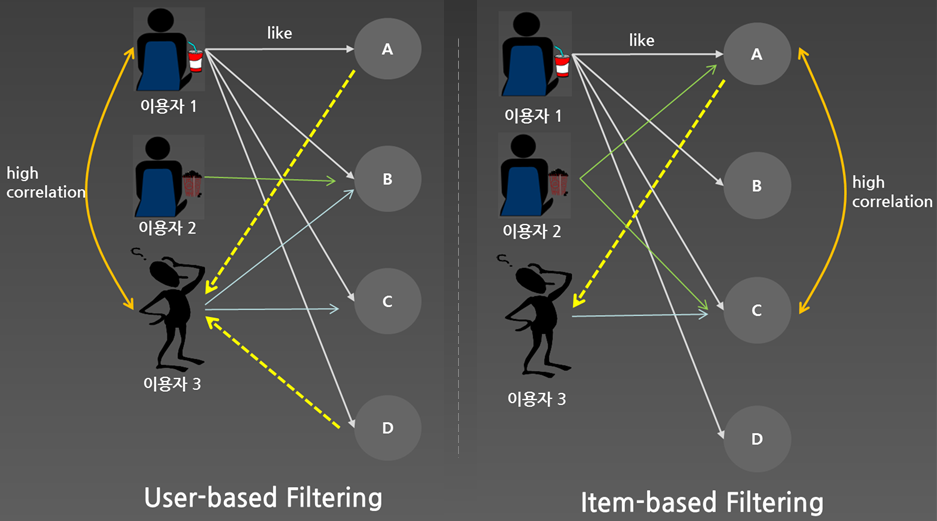

# 협업 필터링(COLLABORATIVE FILTERING) 모델

#### 협업 필터링이란
- 많은 사용자들로부터 얻은 선호정보(taste information)에 따라 사용자들의 관심사들을 자동적으로 예측하게 해주는 방법
- 일반적으로 추천시스템에 많이 쓰이는 모델

#### 사용예
- 아마존 제품 추천 시스템(전체 매출의 30%)
- 넷플릭스 영화 추천 시스템(컨텐츠 이용의 2/3)
- 아마존과 넷플릭스는 제품 기반 필터링을 기반으로 자체 개발한 알고리즘을 활용한다고 알려져 있음 

#### 협업필터링의 종류

- 사용자 기반 필터링(User Based Filtering)
    - 사용자간의 유사도를 계산하여 비슷한 유형의 사용자로부터 추천정보를 얻음
    - 데이터양이 작고, 데이터 변경이 자주 일어나는 경우
    - 실시간으로 유사도를 계산
- 제품 기반 필터링(Item Based Filtering)
    - 제품간의 유사도를 계산하여 이미 상비슷한 제품을 추천하는 방법
    - 데이터양이 크고, 데이터 변경이 자주 일어나지 않는 경우
    - 항목간 유사도를 저장하여 사용
- 컨텐츠 기반 필터링(Content Based Filtering)

#### 사용자 기반 협업 필터링 과정
1. 선호도 조사 및 수치화
    - 사용자별 제품에 대한 선호도 조사
2. 유사도 계산
    - 사람간 유사도 계산
3. 추천
    - 가장 유사한 사람이 가장 선호하는 항목 추천

#### 제품 기반 협업 필터링 과정
1. 선호도 조사 및 수치화
    - 제품별 사용자의 선호도 조사
2. 유사도 계산
    - 제품간 유사도 계산
    - 제품간 유사도 정보 저장
3. 추천
    - 추천 가능한 항목 중 가장 유사한 항목을 추천

#### 협업필터링에서 사용되는 알고리즘
- 유사도 계산
    1. 유클리디안 거리 : 두 객체 간의 선호도 거리를 계산하여, 작을 수록 비슷한 성향을 가짐
    2. 피어슨 상관계수 : 두 객체 간의 선호도를 백터화 하여, 백터 사이의 각도가 적을 수록 유사
    3. 자카드 계수 : 두 객체 간의 요소들의 전체 요소들 중 교집합되는 요소가 차지하는 비중
    4. 맨해튼 거리
    
#### 유용한 라이브러리
- Apache Mahout : 아파치 소프트웨어 재단의 한 프로젝트로서 분산처리가 가능하고 확장성을 가진 기계학습용 라이브러리
- Apache Spark(MLlib) : 범용적 목적의 분산 고성능 클러스터링 플랫폼
    
#### References
- https://www.slideshare.net/bage79/ss-45783615
- https://www.slideshare.net/TaeYoungLee1/20141223-mahout
