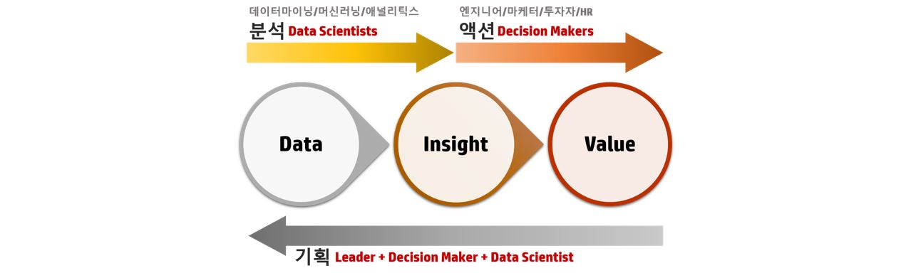
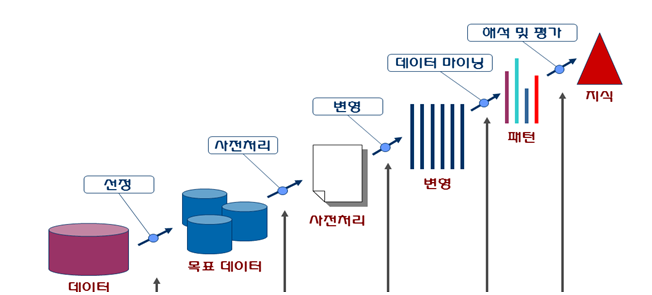

# Data Mining

### Data Mining 이란?
- Data Mining이란 데이터 간의 관계, 패턴, 규칙 등을 찾아내고 모형화해서 insight와 foresight를 도출함으로써, 사실에 근거한 객관적 의사결정을 가능하게 하는 일련의 계산 과정

### Big Data 와의 관계
- 분산 데이터베이스 기술 및 병렬처리 기술 발전에 힘입어, 짧은 시간에 대량으로 생성되는 텍스트와 이미지 동영상 같은 다양한 데이터로 대표되는 빅데이터에 대한 분석이 데이터마이닝

### Data Mining 을 위해 필요한 능력
- 데이터를 다루는 능력 : 데이터베이스, 알고리즘, 프로그래밍
- 분석 능력 : 통계, 확률, 인공지능, 기계학습
- 소통능력

### Data Mining 절차

* 선정
    - 데이터중에 결과를 도출하는데 필요할 만한 데이터 추출
* 전처리
    - 불완전, 모순된, 유효하지 않은 값들을 처리해주는 단계 
* 변형
    - 데이터의 변수들을 검증하면서 불필요한 변수들을 확인하고 제거
* 데이터마이닝
    - 데이터 마이닝 모델 구축(분석유형 -> 기법 -> 알고리즘)후 이를 적용하여 데이터 마이닝 작업을 수행
* 해석 및 평가
    - 마이닝 작업을 통해 나온 결과를 의사결정에 활용할 수 있도록 해석, 검증

### Data Mining 분석 유형
* Classification
    - 분류 값이 포함된 과거의 데이터로부터 분류별 특성을 찾아내어 분류모형을 만들고, 이를 토대로 새로운 레코드의 분류 값을 예측하는 것
    - Discrimination Analysis / 의사결정가지(Decision Tree) / 인공신경망(Artificail Neural Network)
* Prediction
    - 데이터 내 변수들 간의 영향관계 또는 인과관계를 분석하여 어떤 현상을 설명하고 예측하는 것
    - 회귀, 시계열분석(Regression, Forecasting) / 동시발생 매트릭스(Co-ocurrence matrix)
* 연관규칙
    - 데이터 안에 존재하는 항목간의 동시발생관계 또는 종속관계를 찾아내는 작업
    - 장바구니분석(Market Basket Analysis) / Link Analysis
* Clustering
    - 데이터 풀(pool)에서 다수의 소그룹이나 집단을 분류 해내는 작업
    - Cluster Analysis / K-means Clustering

### 응용분야
- 여행 : 여행자 패턴 분석을 통한 여행상품 추천
- 금융 : 신용평가모형
- 유통 : 데이터 베이스 마케팅
- 의료 : 바이러스 전염 패턴
- 치안 : 범죄 패턴, 범인 행동패턴
- 제조 : 통계적 품질 관리

### References
- http://dm.snu.ac.kr/ko/
- https://www.slideshare.net/kwnam4u/01-41434457
