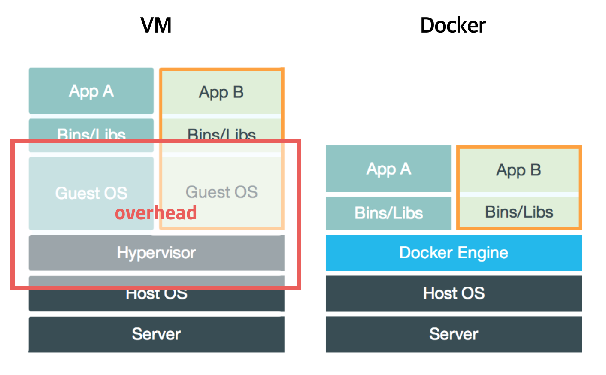
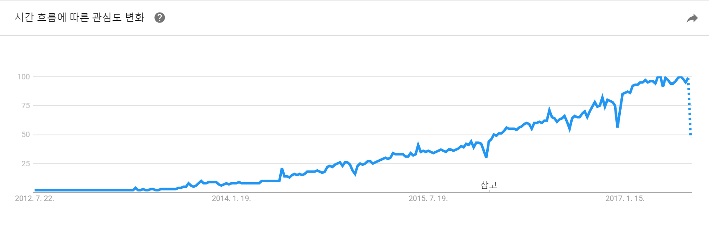

# DOCKER

#### Docker란
- 2013년 3월 Docker, Inc에서 출시한 오픈소스 컨테이너 프로젝트로 리눅스 컨테이너 기반의 오픈소스 가상화 플랫폼
- 복잡한 리눅스 서비스 운영 환경을 컨테이너 이미지로 묶어서 손쉽게 배포하고 실행하는 경량 컨테이너 기술

#### VM과 Docker 컨테이너

* VM
    - Host OS에 VMware, VirtualBox같은 플랫폼을 이용해 Guest OS를 설치 하는 방식
    - 사용법이 비교적 간단하고 여러가지 OS를 가상화하여 사용할수 있음
    - Guest OS 각각 자원을 할당 받아 사용하기 때문에 무겁고 느려 운영환경에선 적절하지 않음
* Docker 컨테이너
    - Host OS에 컨테이너 엔진(Docker)을 설치하고 그 위에 가상OS가 아닌 실행파일/라이브러리등을 격리해서 설치하는 방식
    - 모든 컨테이너들이 Host OS의 자원을 공유해서 사용하기 때문에 가상화에 따른 성능 손실이 거의 발생하지 않음
    
#### Docker 이미지
- 컨테이너 구동에 필요한 파일과 설정값등을 포함하고 있는 파일로 상태값을 가지지 않고 변하지 않음
- 이미지를 구동시킨 상태가 컨테이너라고 볼수 있음
- 한 이미지에서 여러개의 컨테이너를 생성할 수 있음
- 컨테이너의 상태값이 바뀌면 그대로 새로운 이미지로 생성할 수 있음

#### Docker가 인기를 얻는 이유

- 클라우드 컨테이너 세계의 de facto standard
- AWS, Google Could Platform, Microsoft Azure등의 클라우드 서비스에서 공식 지원
- 컨테이너 이미지를 저장하고 전세계 사람들과 자유롭게 공유할 수 있는 Docker Hub 제공
- 사용하기 쉬운 Command와 API

#### TODO
- Docker 사용법(설치, 컨테이너활용, 이미지활용, 배포하기)
- Docker 개발단계에서의 활용법
- Docker 배포운영 단계에서의 활용법
    
#### References
- https://www.docker.com
- https://subicura.com/2017/01/19/docker-guide-for-beginners-1.html
