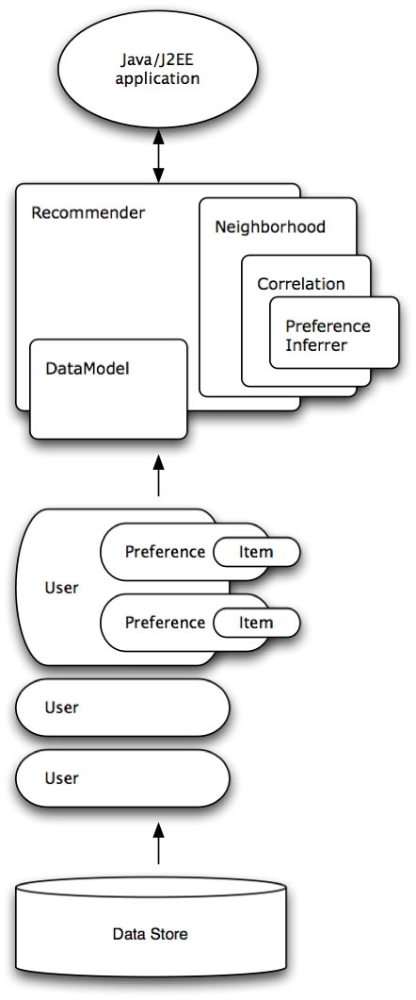

# Mahout Recommender

#### Mahout 이란?
- 아파치 소프트웨어 재단의 한 프로젝트로서 분산처리가 가능하고 확장성을 가진 기계학습용 라이브러리

#### 추천 시스템 아키텍쳐

#### 추천 시스템 처리 과정
1. 데이터 모델 생성
    - 입력 데이터 규칙 : 사용자ID(정수, Long), 아이템ID(정수, Long), 선호수치(큰 값일수록 선호도가 높은 실수, 일반적으로 0~5사이의 값을 많이 사용, Double)
    - 선호수치 데이터가 없을 경우 Boolean Preference를 이용하여 분석 가능 

2. 유사도 모델 생성(유사도는 -1 ~ 1의 범위를 가지며 1과 가까울 수록 서로 유사하다는 의미)
    - 유사도 모델 알고리즘 종류(더있음 대표적인것만)
        1. 피어슨 상관관계 알고리즘	 	: PearsonCorrelationSimilarity
        2. 유클리드 거리 알고리즘 		: EuclideanDistanceSimilarity
        3. 스피어만 상관관계 알고리즘 	: SpearmanCorrelationSimilarity
        4. 맨하튼 거리 알고리즘         : CityBlockSimilarity

    - 사용자 기반 유사도 모델
        - We could have created an item-based recommender instead. Item-based recommenders base recommendation not on user similarity, but on item similarity. In theory these are about the same approach to the problem, just from different angles. However the similarity of two items is relatively fixed, more so than the similarity of two users. So, item-based recommenders can use pre-computed similarity values in the computations, which make them much faster. For large data sets, item-based recommenders are more appropriate.
        - 사용자 기반 유사도 모델은 나의 선호 행동을 기준으로 하기 때문에, 실시간으로 처리해야함 
        - 사용자 기반 유사도 모델 생성
            - param : DataModel, (가중치)
            - return : UserSimilarity
        - 유사한 이웃 그룹 생성
            1. 고정 크기 이웃	: NearestNUserNeighborhood
                - param : 이웃의수, UserSimilarity, DataModel
                - return : UserNeighborhood
            2. 임계치 기반 이웃	: ThresholdUserNeighborhood
                - param : 임계치, UserSimilarity, DataModel
                - return : UserNeighborhood
                
    - 아이템 기반 유사도 모델
        - User-based recommenders are the “original”, conventional style of recommender systems. They can produce good recommendations when tweaked properly; they are not necessarily the fastest recommender systems and are thus suitable for small data sets (roughly, less than ten million ratings). We’ll start with an example of this.
        - 아이템 기반 유사도 모델은 상대적으로 시간에 따른 변동폭이 크지 않기 때문에, 주기적으로 미리 계산해 처리해 놓음
        - 아이템 기반 유사도 모델 생성(GenericItemSimilarity)
            - param : Collection<GenericItemSimilarity.ItemItemSimilarity>
            - return : ItemSimilarity

3. 추천기 생성
    - 사용자 기반 추천기 : GenericUserBasedRecommender
        - param : DataModel, UserNeighborhood, UserSimilarity
        - return : UserBasedRecommender
        
    - 아이템 기반 추천기 : GenericItemBasedRecommender
        - param : DataModel, ItemSimilarity
        - return : ItemBasedRecommender

4. 추천 결과 보기
    - Recommender클래스에서 recommend메소드 사용
    - param : userId, 추천받을 item 개수
    - return : List<RecommendedItem>

5. 추천기 캐싱
    - param : UserBasedRecommender, ItemBasedRecommender
    - return : Recommender

#### References
- http://mahout.apache.org/users/recommender/recommender-documentation.html
- https://www.slideshare.net/pitzcarraldo/mahout-cook-book