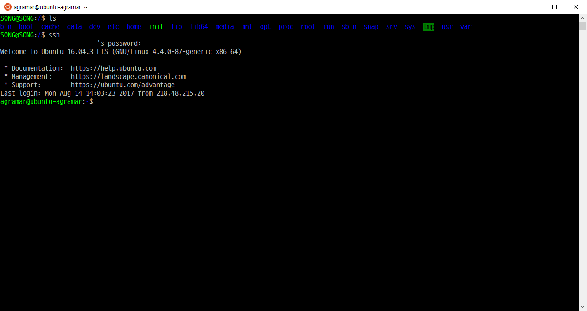

# 윈도우10에서 우분투 사용하기(Windows 10 Bash)

## Windows 10 Bash
- 윈도우에서 Linux환경을 가상머신이나 컨테이너 없이 구동시켜주는 환경
- 리눅스중 우분투를 기반으로 하고 있음
- 실행 화면

## 설치 과정
1. 윈도우 최신버전으로 업데이트
2. 제어판 설정
    - 제어판 - 프로그램 - 프로그램 및 기능 - Windows 기능 켜기/끄기 - Linux용 Windows 하위 시스템 체크
3. Bash 설치
    - cmd prompt 들어가서 bash 입력
    - 설치 진행

## 사용후 느낀 장단점
- 장점
    - 왠만한 Linux 애플리케이션 실행 가능 (저 같은 경우 jekyll이 윈도우 환경을 지원하지 않아 이걸 사용해보기 위해 설치해서 사용했는데 별 무리 없이 사용 가능 했음)
    - SSH 연결 도구(putty 같은 프로그램 없이 bash shell에서 ssh 접속 환경 지원)
- 단점
    - 복잡한 애플리케이션은 아직은 구동 불가능(Docker, Apache)
    - Bash에서 Windows파일 시스템은 접근 가능하지만 그 반대의 경우는 아직은 불가능